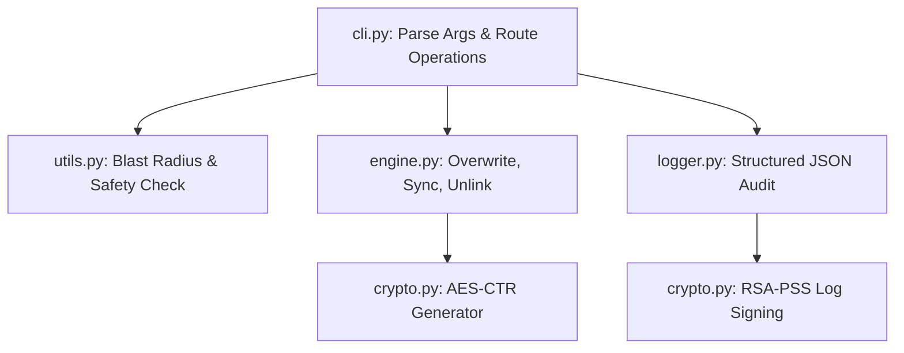

# VIPER Architecture & Engineering Guide

VIPER uses a modular, component-based architecture designed for maintainability, strict cryptographic enforcement, and cross-platform compatibility.

## High-Level Topology
The core engine (`viper_core`) is split into four distinct logic boundaries:

## Component Roles

### `cli.py` (Orchestration Layer)
- Defines the `argparse` CLI interfaces.
- Initializes RAM-cap calculations via `psutil`.
- Dispatches execution to `concurrent.futures.ThreadPoolExecutor`.

### `engine.py` (Execution Layer)
- Handles raw sector wiping, MFT slack clearing, and algorithm pattern passes (NIST, DoD, Gutmann).
- Dispatches filesystem API calls for `fcntl` locks, `os.utime` (MAC timestamps), and filename obfuscation.
- Performs `truncate_and_unlink` execution.
- Contains fallbacks for Windows-specific NVMe firmware commands vs. Linux block devices.

### `crypto.py` (Cryptographic Enforcement)
- **Generator**: Uses `cryptography.hazmat` AES-CTR for high-speed, verifiable CSPRNG data streams during `csprng` passes.
- **Auditing**: Handles the `BestAvailableEncryption` RSA-2048 key generation and executes RSA-PSS PKCS#8 signatures over the JSON audit logs to prevent tampering.

### `utils.py` (Safety & Validation)
- Enforces the **Blast-Radius** deny list (preventing `C:\Windows` or `/boot` from being targeted or symlink-traversed).
- Resolves POSIX symlinks to their `real_path` to prevent accidental symlink deletion vs target destruction.

### `logger.py` (Audit Trail)
- Dual-channel system: colorized terminal output for operators, and strict `JSON` disk lines for parsers.

## Execution Flow (Single Target)
1. `cli.py` resolves path and fires `assert_not_critical()` (Blast-Radius check).
2. Path goes to `engine.py` `wipe_file()`.
3. `engine.py` opens `O_RDWR` and fires `N` chunked passes writing `0x00`, `0xFF`, or AES-CTR blocks from `crypto.py`.
4. `os.fsync()` guarantees mechanical / flash boundary commit.
5. MAC timestamps are randomized -> File is iteratively renamed (MFT obfuscation) -> File is truncated -> `os.unlink()`.
6. Event is JSON-logged to `logger.py`.
7. Once CLI loop finishes, `crypto.py` hashes and signs the final log.
